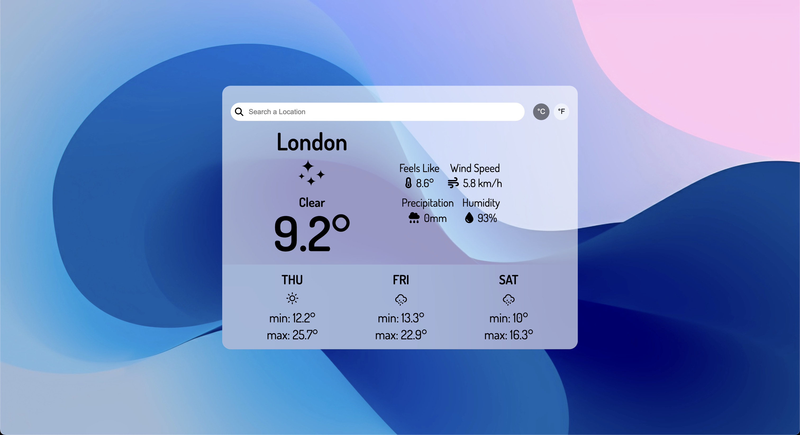

# Weather App

A sleek and responsive weather forecast application built with vanilla JavaScript, HTML, and CSS — powered by the [WeatherAPI](https://www.weatherapi.com/) and bundled using Webpack.



---

## Live Demo
[View Live Application](https://leoandradej.github.io/weather-app/)

---

## 🚀 Features

- Search weather by location (city name)
- Toggle between Celsius and Fahrenheit
- 3-day weather forecast
- Error handling for invalid searches
- Dynamic weather icons
- Built with Webpack

---

## Tech Stack

- JavaScript (ES6+)
- HTML5 & CSS3
- Webpack 5
- WeatherAPI

---

## Getting Started

### 1. Clone the Repository
```bash
git clone https://github.com/leoandradej/weather-app.git
cd weather-app
